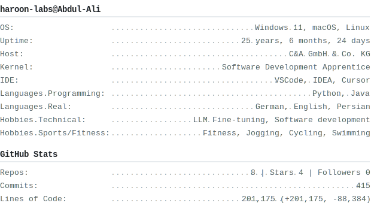

# Haroon Abdul-Ali

<table style="width: 100%; border: none;">
<tr>
<td width="35%" valign="bottom" style="padding-right: 20px; border: none;">

<picture>
  <source media="(prefers-color-scheme: dark)" srcset="dark.png">
  
</picture>

</td>
<td width="65%" valign="top" style="border: none;">

<b>Contact</b>

Email.Personal: <a href="mailto:haroon.aa.dev@gmail.com">haroon.aa.dev@gmail.com</a>
 LinkedIn: <a href="https://www.linkedin.com/in/aa-haroon/">Haroon Abdul-Ali</a>

</td>
</tr>
</table>

---

## About

Software developer passionate about building elegant solutions at the intersection of web technologies, AI, and automation. Exploring the cutting edge of LLMs, network architecture, and creative coding.
 **Currently exploring:** GraphQL APIs • Modern Python • Machine Learning • Open Source Development • JavaScript • React
