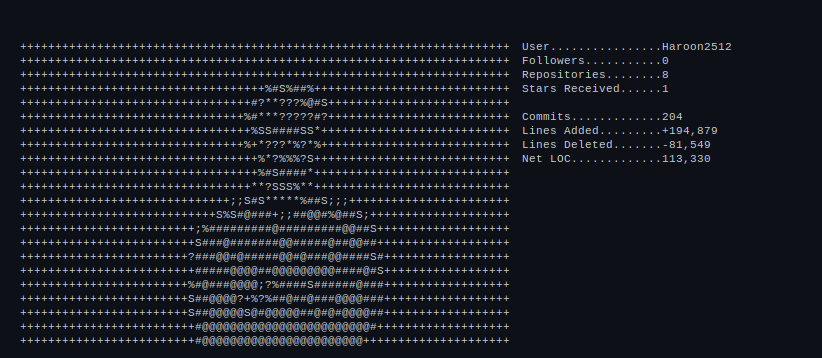

# Haroon Abdul-Ali

```
    @@@@@@@@@@@@
   @@@@@@@@@@@@@@
  @@@@@@@@@@@@@@@@
 @@@@@@@@@@@@@@@@@@@
@@@@@@@@@@@@@@@@@@@@
@@@@@  HAROON  @@@@@
@@@@@@@@@@@@@@@@@@@@
 @@@@@@@@@@@@@@@@@@@
  @@@@@@@@@@@@@@@@@@
   @@@@@@@@@@@@@@@@
    @@@@@@@@@@@@
```

---

**OS:**..................................... Windows 11, Linux  
**Uptime:**............................... Always Learning  
**Host:**................................... Digital Future Lab  
**Kernel:**................................ Growth-Oriented Mindset  
**IDEs:**................................... VS Code, Neovim

---

**Languages.Programming:**................. Python, JavaScript, TypeScript, Java  
**Languages.Computer:**................... HTML, CSS, SQL, Markdown  
**Languages.Real:**........................ English, German

---

**Hobbies.Software:**..................... Web Development, AI/ML, Open Source  
**Hobbies.Hardware:**..................... Tech Gadgets, Automation

---

**Contact:**
- **Email.Personal:**..................... haroonabdulali.w@gmail.com  
- **Email.Work:**......................... [your work email]  
- **LinkedIn:**........................... linkedin.com/in/HaroonAbdul-Ali  
- **Discord:**............................ [your discord handle]

---

## GitHub Stats



---

## About Me

Passionate developer crafting elegant solutions to complex problems. I specialize in full-stack development and love exploring the intersection of AI, web technologies, and automation.

Currently exploring: GraphQL APIs, modern Python frameworks, and machine learning applications.

---

## Featured Projects

- **HaroonAbdul-Ali** — GitHub profile stats generator with ASCII art + SVG rendering
- *More projects coming soon...*

---

**Let's connect!** Drop me a message on LinkedIn or email for collaborations, questions, or just to chat about tech.
