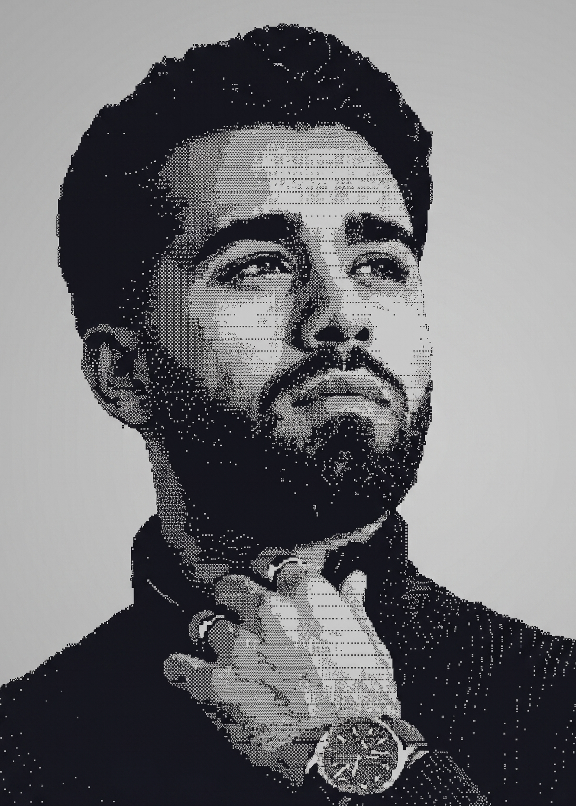

# Haroon Abdul-Ali

<table style="width: 100%;">
<tr>
<td width="35%" valign="bottom" style="padding-right: 20px;">

<picture>
  <source media="(prefers-color-scheme: dark)" srcset="dark.png">
  
</picture>

</td>
<td width="65%" valign="top" style="font-family: 'Courier New', monospace; font-size: 12px; line-height: 1.3; color: var(--color-fg-muted);">
**haroon-labs@Abdul-Ali**

OS:.......................................................... Windows 11, macOS, Linux
 Uptime:................................................... 25 years, 6 months, 22 days
 Host:............................................................... C&A GmbH & Co. KG
 Kernel:........................ Software Development Apprentice | Software Engineering
 IDE:............................................................. VSCode, IDEA, Cursor
 Languages.Programming:..................................... Python, Java, (JavaScript)
 Languages.Real:.............................................. German, English, Persian
 Hobbies.Technical:.............................. LLM Fine-tuning, Software development
 Hobbies.Sports/Fitness:........................... Fitness, Jogging, Cycling, Swimming
  **Contact**

Email.Personal:............................................... <a href="mailto:haroon.aa.dev@gmail.com">haroon.aa.dev@gmail.com</a>
 LinkedIn:............................................................ <a href="https://www.linkedin.com/in/aa-haroon/">Haroon Abdul-Ali</a>
  **GitHub Stats**

Repos:...................................................... 8 | Stars 1 | Followers 0
 Commits:.......................................................................... 327
 Lines of Code:............................................ 197,742 (+197,742, -85,212)
</td>
</tr>
</table>

---

## About

Full-stack developer passionate about building elegant solutions at the intersection of web technologies, AI, and automation. Exploring the cutting edge of LLMs, network architecture, and creative coding.
 **Currently exploring:** GraphQL APIs • Modern Python • Machine Learning • Open Source Development
